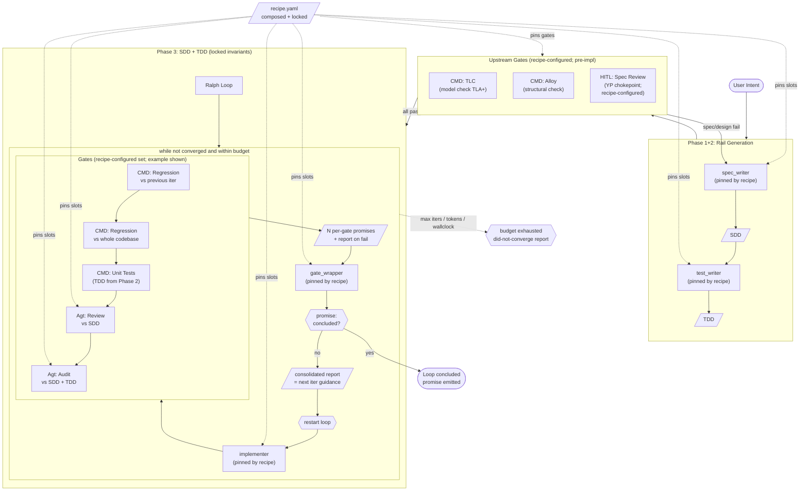

# Wanabai 0.1: The Spec-Mediated Attestation Harness

*A yellow paper on the transitional architecture. Companion to the [Wanabai white paper](WHITEPAPER.md).*

## Overview

A model-agnostic coding-agent harness. The user supplies an *intent*; agnostic
models pinned to upstream slots translate intent → SDD → TDD. Once both rails
are produced, they become the invariants the Ralph loop is bound to. A pinned
implementer is driven through a sequence of gates whose set is defined by the
recipe; each configured gate emits its own promise (pass/fail) and a report
on fail. A pinned `gate_wrapper` then consolidates the gate promises into a
single final *concluded* promise — the signal the Ralph loop's `while` looks
for. On "concluded" the loop exits with the promise alone. On "not concluded"
the wrapper also produces a single consolidated report; the loop restarts
with that report as the next iteration's bounded scope. Slot-to-model
assignment, gate set, and per-gate rigor are all governed by the composable
YAML recipe.

## References

This harness specifies orchestration topology and gate contracts. For
canonical content of the specification corpus, verification toolchain,
attestation layers, tier model, and migration path toward steady-state
Wanabai, see the companion yellow paper:

- **YP** — *The Attestation Layer: Architecture Specification*
  (Saturnino, 2026). Cited inline as `[YP §<section>]`.

This document is **Wanabai 0.1** — the harness implementation of the
transitional architecture YP specifies for the 2026–2030 window. The
steady-state architecture (Wanabai) described in the companion white
paper *Wanabai: Software as Electricity* is the trajectory this harness
evolves toward as YP's migration path closes the spec-review chokepoint.

## Diagram



## Components

### User Intent

The originating artifact. The user's natural-language statement of what they
want built. Phases 1 and 2 translate this into the rails for Phase 3.

### Spec Writer (Phase 1)

Pinned by recipe. Translates user intent into the SDD. Acts as the
*Specifier Agent* role per [YP §Spec-Mediated Verification Pipeline]; the
SDD comprises the higher-tier spec artifacts (architectural models,
contracts, optional TLA+/Dafny/Lean specifications) per
[YP §Specification Tiers].

### Test Writer (Phase 2)

Pinned by recipe. Translates the SDD into the TDD test suite — properties
and runtime contracts per [YP §Tier 1 — Property-Based Testing] and
[YP §Tier 2 — Contracts and Invariants]. The TDD is the suite executed by
the unit-tests gate in Phase 3 when the recipe configures one. Together
with the SDD, it forms the spec corpus per
[YP §The Specification Artifact as Theory Container] (the canonical
`specs/` directory layout).

### Spec Review Chokepoint (Upstream Gate)

The HITL gate per [YP §The Spec-Mediated Verification Pipeline] and
[YP §Human Review Points]. Sits between Phases 1+2 (rail generation) and
Phase 3 (Ralph loop). The reviewer reads the *spec corpus*, not the code;
this is the load-bearing premise of YP — *"review the spec, not the
code."*

Three configuration modes, all recipe-controlled:

- **HITL (recommended for transitional architecture).** Recipe declares a
  `human_review` upstream gate. A human reviews the SDD and TDD before
  Phase 3 begins. Approval gates Phase 3; rejection routes back to
  `spec_writer` (or `test_writer`, depending on which artifact was
  flagged).
- **HOTL (default if omitted).** No human review gate. The recipe pins
  an agent (typically a `spec_reviewer` slot or the `auditor` slot
  pre-impl) to perform an automated spec-quality check.
- **Mixed.** HITL for high-stakes specs (TLA+ models for distributed
  protocols), HOTL for routine property/contract specs. Recipe declares
  per-tier review policy.

Failure modes from this gate are *design-level* and route upstream
(spec_writer, test_writer), never to the implementer. See *Escalation
Patterns* below.

### Frame: SDD + TDD

The spec and test suite, produced by Phases 1 and 2, form the spec corpus
described in [YP §The Specification Artifact as Theory Container] —
organized as `specs/properties/`, `specs/contracts/`, `specs/models/`
(TLA+), `specs/verified/` (Dafny/Lean). They are hard rails for Phase 3:
the Ralph loop cannot mutate them; it can only produce code that
satisfies them. Per YP, `src/` is a regenerable compilation of `specs/`.
Gates read from this frame.

### Ralph Loop

Outer driver of Phase 3. Owns the iteration counter and budget. Each
iteration runs all recipe-configured gates, then invokes the
`gate_wrapper` agent. The wrapper emits a binary concluded promise — the
signal the loop's `while` checks for completion. On "concluded" the loop
exits; on "not concluded" the wrapper also produces a consolidated report
that bounds the implementer's scope on the next iteration: the next pass
addresses *only* the issues called out in that report, not unrelated
refactors or improvements, and not the raw per-gate reports.

### Recipe (composable YAML)

Slot-to-model assignment. Six slots:

| Slot           | Phase | Purpose                                                  |
|----------------|-------|----------------------------------------------------------|
| `spec_writer`  | 1     | Intent → SDD                                             |
| `test_writer`  | 2     | SDD → TDD                                                |
| `implementer`  | 3     | Pinned author of code under test                         |
| `reviewer`     | 3     | Agt Review gate                                          |
| `auditor`     | 3     | Agt Audit gate                                            |
| `gate_wrapper` | 3     | Consolidate gate promises into final promise + report    |

- **Composition:** base recipe + overlays, deep merge, child wins.
- **Resolution:** composed recipe is written to `recipe.lock.yaml` at run
  start; the run uses the lock, not the source files.
- **Override semantics:** overlays may override or null-out slots. They
  cannot delete keys via omission (typo safety).
- **Gates config (upstream + downstream):** the recipe declares the full
  gate set — both **upstream gates** (between Phases 1/2 and Phase 3, e.g.,
  TLC model check on TLA+ specs per [YP §Tier 3], Alloy structural check,
  human review of spec) and **downstream gates** (per-iteration in Phase
  3, e.g., property tests, contract checks, agentic review/audit).
  Tier-to-gate mapping follows [YP §Specification Tiers] and
  [YP §Specification Language Selection Guide].
- **HITL spec-review chokepoint:** the upstream gate set may include a
  human review gate per [YP §The Spec-Mediated Verification Pipeline] and
  [YP §Human Review Points]. Configured in recipe YAML; **if omitted,
  agents handle the chokepoint and the run is HOTL.**
- **Diversity:** `auditor == implementer` and `gate_wrapper == implementer`
  are lint warnings, not runtime errors. Surfaced by `recipe validate`.

### Implementer (pinned)

Pinned by recipe. Loop does not swap models on failure — it retries the same
model with richer feedback. Convergence is the implementer's responsibility;
the circuit breaker is the operator's protection against structural
incapacity.

### Gates

The recipe defines which gates run on each iteration to approve the
implementation. Each gate — deterministic or agentic — emits a binary
promise (pass/fail) and, on fail, a report explaining what didn't pass.
All configured gates run on every iteration regardless of individual
failures; a failing gate does not short-circuit the rest. The N gate
promises (and any failure reports) are consumed by the `gate_wrapper`
agent (see below), which produces a single final promise and, on "not
concluded," a single consolidated report — that consolidated report,
not the individual gate reports, is what bounds the implementer's scope
on the next iteration.

**Agent-determined rigor.** For agentic gates (review, audit, etc.) the
rigor of the check is determined by the agent pinned to that slot, not
by the harness. A `reviewer` slot can be pinned to a basic style-and-typo
agent or to one that performs full spec-conformance verification with
web research. Likewise an `auditor` slot can be pinned to a quick
injection-check agent or to one that runs full harness verification,
fetches latest rules from the web, and re-runs full test suites. The
harness is agnostic to rigor; it requires only that the pinned agent
honor the promise/report contract. See [YP §Specification Language
Selection Guide] and [YP §The Attestation Stack] for the full tier model
and per-tool characteristics.

**Gate taxonomy.** Gates fall into three classes by *what* they check
and *when*:

| Class                         | Stage                  | Examples (mapping to YP tiers)                                                              |
|-------------------------------|------------------------|---------------------------------------------------------------------------------------------|
| Spec-stage deterministic      | upstream (pre-impl)    | TLC on TLA+ specs ([YP §Tier 3]); Alloy structural checks; spec internal-consistency checks |
| Code-stage deterministic      | downstream (per-iter)  | Hypothesis property tests ([YP §Tier 1]); runtime contracts ([YP §Tier 2]); Dafny + Z3 ([YP §Tier 4]); Lean kernel ([YP §Tier 4]); regression suites |
| Agentic                       | upstream or downstream | spec reviewer; SDD-conformance reviewer; auditor (rigor agent-determined)                   |
| Continuous (post-`concluded`) | post-loop              | Trace verification with TLC ([YP §Tier 5]); runtime contracts in production                 |

Continuous gates (the last row) are *not* part of the Ralph loop. They
fire after the loop emits "concluded," validating runtime behavior
against the spec corpus indefinitely. Outside the scope of this
harness; mentioned for completeness.

The table below shows a typical example *downstream* gate set. Ordering
is for log readability and conventional cost progression, not control
flow.

| Order | Gate                          | Type          | Purpose                                                  |
|-------|-------------------------------|---------------|----------------------------------------------------------|
| 1     | CMD Regression vs prev iter   | deterministic | catch what this iteration broke                          |
| 2     | CMD Regression vs codebase    | deterministic | catch what the impl broke globally                       |
| 3     | CMD Unit Tests                | deterministic | run the TDD suite produced by `test_writer` in Phase 2   |
| 4     | Agt Review vs SDD             | agentic       | does the implementation match the spec?                  |
| 5     | Agt Audit                     | agentic       | independent correctness check vs SDD + TDD               |

### Gate Wrapper

Pinned by recipe. Runs after all configured gates have completed.
Consumes the N per-gate promises (and any reports from failed gates)
and produces:

- A single final binary *concluded* promise — the signal the Ralph
  loop's `while` checks for completion.
- On "not concluded," a single consolidated report — the guidance
  document for the next iteration. On "concluded," no report.

Outcomes:

- **Concluded:** the wrapper attests the implementation satisfies the
  rails. The loop exits with the promise alone — no final report is
  produced.
- **Not concluded:** the consolidated report becomes the implementer's
  bounded scope on restart.

Per-gate report payloads conform to [YP §Feedback Loops] (shrunk
Hypothesis input, contract violation with input state, TLC error trace,
Z3 counterexample with loop-invariant hints) — these are the canonical
schema variants the wrapper consolidates. Design-level failures (TLC
invariant violations, Dafny unprovable postconditions) are escalated
upstream rather than retried in-loop, per [YP §Feedback Loops] *"TLC
invariant violation → ESCALATE TO HUMAN."*

### Promise/Report Contract

The interop schema every gate and the wrapper must honor. The harness
owns the envelope; YP §Feedback Loops owns the per-tool payload shapes.

**Per-gate output:**

```
GatePromise = {
  gate_id: string                   # unique within the recipe
  verdict: "pass" | "fail"
  report?: GateReport               # required iff verdict == "fail"
}

GateReport = {
  gate_id: string
  payload: PayloadVariant           # one of the variants below
}
```

**Payload variants (per [YP §Feedback Loops]):**

- `property_violation` — `{property_name, shrunk_input, prev_impl_diff?}`
- `contract_violation` — `{which_pre_or_post, input_state, expected, actual}`
- `tlc_violation` — `{error_trace: state_sequence, invariant_name}` *(escalates upstream)*
- `dafny_unprovable` — `{counterexample, postcondition, suggested_invariants?}` *(may escalate upstream)*
- `lean_proof_failure` — `{tactic, goal_state, suggested_lemma?}`
- `regression_failure` — `{failing_tests: [...], baseline_ref}`
- `agentic_finding` — `{findings: [{file, line, severity, message, evidence?}]}`
- `human_rejection` — `{reviewer, rejected_artifact, reason}` *(upstream HITL only)*

**Wrapper output:**

```
WrapperOutput = ConcludedPromise | NotConcludedReport

ConcludedPromise = {
  verdict: "concluded"
  iteration: int
  evidence: [GatePromise]           # all N gate promises (must all be "pass")
}

NotConcludedReport = {
  verdict: "not_concluded"
  iteration: int
  scope: [
    { source_gate: string, file?, line?, issue: string, payload: PayloadVariant }
  ]
}
```

The `evidence` field on `ConcludedPromise` makes the wrapper's verdict
*derivable* — a wrapper may only emit `concluded` when every entry in
`evidence` has `verdict: "pass"`. This removes wrapper discretion on
the exit path; the wrapper retains synthesis authority only on the
not-concluded path.

### Circuit Breaker

Bounded `while`. Exit conditions:

- `gate_wrapper` emits "concluded" promise → loop exits with the promise.
  No final report.
- Budget exhausted (max iterations, tokens, or wall-clock) → did-not-converge
  report with the full feedback trail.

## Escalation Patterns

Routing matrix for gate failures. The destination depends on *what kind
of bug the failure indicates*, not which gate emitted it. Per
[YP §Feedback Loops], design-level failures escalate upstream rather
than retrying in-loop.

| Failure type                         | Source            | Destination                        | Reason                                    |
|--------------------------------------|-------------------|------------------------------------|-------------------------------------------|
| TLC invariant violation              | upstream gate     | `spec_writer` (re-author SDD)      | Design/spec is wrong; no code yet         |
| Alloy structural inconsistency       | upstream gate     | `spec_writer` (re-author SDD)      | Spec model is internally inconsistent     |
| Spec review rejection (HITL)         | upstream gate     | `spec_writer` and/or `test_writer` | Human says spec doesn't match intent      |
| Property test failure                | downstream gate   | `implementer` (next iter, bounded) | Code didn't satisfy spec property         |
| Contract violation                   | downstream gate   | `implementer` (next iter, bounded) | Code didn't satisfy contract              |
| Regression failure                   | downstream gate   | `implementer` (next iter, bounded) | Code regressed prior state                |
| Agentic review fail (vs SDD)         | downstream gate   | `implementer` (next iter, bounded) | Implementation diverges from spec         |
| Agentic audit fail                   | downstream gate   | `implementer` (next iter, bounded) | Independent check found correctness issue |
| Dafny unprovable postcondition       | downstream gate   | `spec_writer` *or* `implementer`   | Either spec is wrong (escalate) or impl is wrong (retry); operator-pinned policy |
| Lean proof failure                   | downstream gate   | `implementer` (next iter, bounded) | Tactic-level proof gap; usually impl-side |
| Budget exhausted                     | circuit breaker   | did-not-converge report → operator | No progress; needs human triage           |
| Wrapper malformed/timeout            | gate_wrapper      | did-not-converge report → operator | Wrapper unable to emit promise            |

**Key invariant (per YP):** when a failure routes upstream, Phase 3 is
abandoned for the current run; the spec corpus is re-authored and the
upstream gate set re-runs before Phase 3 restarts. This is the bad-rail
escape — the harness does not waste budget retrying the implementer
against rails it cannot satisfy.

## Resolved Positions

The harness commits to the following positions to align with YP:

1. **HITL.** The harness adopts YP's spec-review chokepoint as a
   first-class concept (see Recipe gate config). When the recipe
   declares a human review gate on the upstream pipeline, the run is
   HITL; when omitted, the run is HOTL with agentic review only.
2. **Spec corpus shape.** The Frame (SDD + TDD) follows YP's `specs/`
   directory layout: `specs/properties/`, `specs/contracts/`,
   `specs/models/` (TLA+), `specs/verified/` (Dafny/Lean). `src/` is a
   regenerable compilation of `specs/` per YP.
3. **Recipe gate scope.** Recipe-defined gates cover both upstream
   (Phase 1/2 spec verification — TLC, Alloy, human review) and
   downstream (Phase 3 implementation gates — property tests, contract
   checks, agentic review/audit).
4. **Architectural position.** The harness is **Wanabai 0.1** — the
   transitional-architecture implementation per YP's 2026–2030
   migration window. The steady-state Wanabai architecture (closed
   loop, full HOTL with exception handling, twelve-stage continuous
   loop) is the trajectory this harness evolves toward as the
   chokepoint dissolves.

## Invariants

1. Implementer model is fixed for the duration of the Ralph loop.
2. Gate failure never triggers a model swap. Downstream failure → loop
   restart with bounded scope; design-level failure → escalate upstream
   per *Escalation Patterns*.
3. All recipe-configured gates run on every iteration regardless of
   individual failures. Each gate emits a binary promise (pass/fail) and,
   on fail, a report. The `gate_wrapper` consolidates the gate promises
   into a single final concluded promise; on "not concluded," it also
   produces a single consolidated report. Iteration N+1's implementer
   scope is bounded by iteration N's consolidated report — not the raw
   per-gate reports. The implementer must address the issues in that
   report and only those issues.
4. Recipe is locked at run start and immutable for the run's duration.
5. Once Phases 1 and 2 produce the SDD and TDD, both are frozen for the
   Ralph loop. No Phase-3 actor — neither the loop nor any gate — may
   mutate them. Design-level failures abandon Phase 3 and re-author
   upstream; the rails are not edited mid-loop.
6. Every gate output conforms to the *Promise/Report Contract*. The
   `gate_wrapper`'s `concluded` verdict is *derivable* — emitted only
   when every gate promise in `evidence` has verdict `pass`. The
   wrapper retains synthesis authority only on the not-concluded path.
